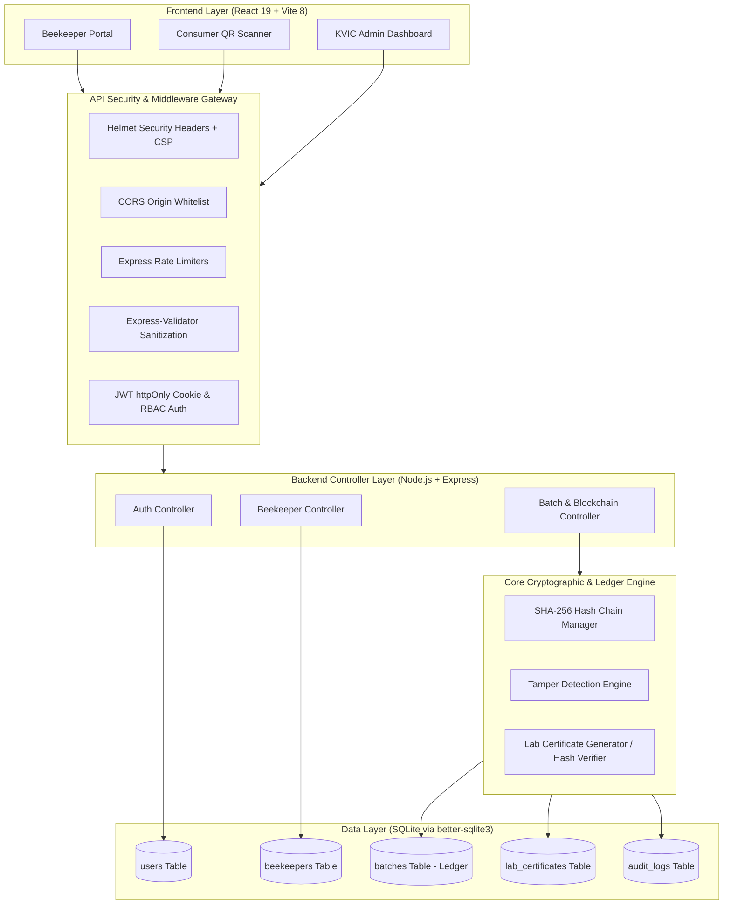

# 🍯 Honey Chain — Security-First Provenance & Traceability Ledger

> **KVIC Honey Mission × Smart India Hackathon (SIH 2026)**  
> **Problem ID**: SIH26021 | **Ministry**: Ministry of Micro, Small and Medium Enterprises (MSME)  
> **Built by**: **Hemanth Rao** (Team Lead) & **Team ACE**

---

## 🌟 Executive Overview

**Honey Chain** is a production-grade, decentralized honey provenance and quality traceability platform designed for the **Khadi and Village Industries Commission (KVIC)**. It bridges rural Indian beekeepers with health-conscious consumers through cryptographic proof of origin, IoT hive telemetry, and a server-side **SHA-256 blockchain ledger**.

### Key Highlights
- 🔐 **Security-First Architecture**: JWT authentication in `httpOnly` + `Secure` + `SameSite` cookies, bcrypt password hashing (12 rounds), role-based access control (RBAC), and express rate-limiting.
- ⛓️ **Server-Side SHA-256 Ledger**: Immutable hash chain persisted in SQLite (`better-sqlite3` in WAL mode) with automated cryptographic tampering detection.
- 🧪 **Cryptographic Lab Verification**: Single-use, batch-specific verification codes generated via `crypto.randomBytes`, hashed before storage, and authenticated with timing-safe comparison.
- 📱 **Consumer QR Traceability**: Instant QR code scan for end-to-end batch provenance, botanical flora verification, and blockchain chain-integrity checks.

---

## 📊 End-to-End System Architecture & Data Flow



---

## 🔄 Exact 5-Step Application Workflow

```
+--------------------------------------------------------------------------------------------------+
| 1. ADMIN ONBOARDING      Admin / KVIC registers Beekeeper Name & assigns authorized Hive IDs.     |
|                          (Beekeepers cannot self-assign unauthorized Hive IDs)                   |
+--------------------------------------------------------------------------------------------------+
                                                │
                                                ▼
+--------------------------------------------------------------------------------------------------+
| 2. BATCH HARVEST         Beekeeper registers Honey Batch -> Server appends new SHA-256 block      |
|                          to SQLite ledger with status: "pending_review".                         |
+--------------------------------------------------------------------------------------------------+
                                                │
                                                ▼
+--------------------------------------------------------------------------------------------------+
| 3. LAB REVIEW            KVIC Admin / Testing Lab inspects honey sample quality & approves batch. |
+--------------------------------------------------------------------------------------------------+
                                                │
                                                ▼
+--------------------------------------------------------------------------------------------------+
| 4. CODE ISSUANCE         Admin approval generates single-use crypto Verification Code             |
|                          (KVIC-XXXX-XXXX) hashed before storage, bound to that specific batch.   |
+--------------------------------------------------------------------------------------------------+
                                                │
                                                ▼
+--------------------------------------------------------------------------------------------------+
| 5. BEEKEEPER VERIFY      Beekeeper inputs the verification code against their batch.              |
|                          On match: Batch status flips to "KVIC Verified & Lab Tested".           |
|                          Single-use code is invalidated; consumer QR is fully verified.          |
+--------------------------------------------------------------------------------------------------+
```

---

## 🛠️ Complete Technical Stack Breakdown

| Layer | Technologies / Packages | Purpose & Highlights |
| :--- | :--- | :--- |
| **Programming Languages** | **JavaScript (ES2023 / Node ESM)**, **SQL**, **HTML5**, **CSS3** | Native ES modules, modern syntax across frontend & backend |
| **Frontend Framework & UI** | **React 19.2**, **Tailwind CSS 4.0**, **Lucide React**, **Recharts** | Reactive state, responsive glassmorphism UI, IoT charts |
| **Runtime & Build Tools** | **Node.js 18+**, **Vite 8.2**, **esbuild**, **oxlint** | Lightning-fast HMR, sub-second production builds, fast linting |
| **Backend Framework** | **Node.js + Express (v4.21 / v5)** | Production REST API with modular controllers, routes, & middleware |
| **Database & Persistence** | **better-sqlite3 (v13.0)** | Embedded zero-latency SQLite engine with Write-Ahead Logging (WAL) |
| **Blockchain / Ledger** | **Node.js `crypto` (SHA-256)** | Server-side hash linking, genesis block anchoring, tamper detection |
| **Authentication & Tokens** | **jsonwebtoken (v9.0)**, **cookie-parser** | Stateless JWT tokens stored in secure `httpOnly` cookies |
| **Password Security** | **bcryptjs (v3.0)** | 12 salt rounds one-way cryptographic password hashing |
| **Input Validation** | **express-validator (v7.3)** | Strict route-level input validation and payload sanitization |
| **Rate Limiting** | **express-rate-limit (v8.7)** | Brute-force & DoS mitigation on auth and code-verification routes |
| **HTTP Security Headers** | **helmet (v8.3)**, **cors** | Content Security Policy (CSP), clickjacking defense, origin lockdown |
| **Environment Configuration**| **dotenv (v17.4)** | Secret isolation for JWT secrets, DB paths, and cookie parameters |

---

## 🔒 Production Security Architecture

1. **HttpOnly Cookie JWT Authentication**: Tokens cannot be accessed by client-side JavaScript, eliminating XSS token theft.
2. **Batch-Specific Hashed Verification Codes**: Generated using `crypto.randomBytes(8)` (e.g. `KVIC-A7B2-9F4C`), hashed with salted SHA-256 prior to DB insertion. Codes cannot be reused or applied across batches.
3. **Prepared SQL Statements**: 100% of SQLite database queries use parameterized prepared statements, preventing SQL injection.
4. **Blockchain Tamper Detection**: Any direct alteration of database batch attributes (quantity, flora, notes) breaks the SHA-256 block hash and immediately flags the ledger as compromised.
5. **Role-Based Access Control (RBAC)**: Strict server-side route guards ensure Beekeepers cannot approve batches or assign hives, and unauthorized users cannot modify data.
6. **Payload Size Guard**: Request parsers limited to `10kb` to eliminate large payload memory exhaustion attacks.

---

## 📡 API Reference

### 1. Authentication Endpoints (`/api/auth`)
| Method | Endpoint | Access | Description |
| :--- | :--- | :--- | :--- |
| `POST` | `/api/auth/register` | Public | Register new user account (Admin / Beekeeper / Consumer) |
| `POST` | `/api/auth/login` | Public | Login with identifier/email + password/OTP; issues JWT cookie |
| `POST` | `/api/auth/logout` | Authenticated | Clears `jwt` auth cookie |
| `GET` | `/api/auth/me` | Authenticated | Fetches authenticated user profile |

### 2. Beekeeper Management (`/api/beekeepers`)
| Method | Endpoint | Access | Description |
| :--- | :--- | :--- | :--- |
| `GET` | `/api/beekeepers` | Public | List all registered beekeeper clusters and hive mappings |
| `GET` | `/api/beekeepers/:id` | Public | Get single beekeeper details and batch history |
| `POST` | `/api/beekeepers` | **Admin Only** | Onboard beekeeper & assign authorized Hive IDs |
| `PUT` | `/api/beekeepers/:id` | **Admin Only** | Update beekeeper profile and assigned hives |
| `DELETE` | `/api/beekeepers/:id` | **Admin Only** | Remove beekeeper and associated records |

### 3. Batches & Blockchain Ledger (`/api/batches`)
| Method | Endpoint | Access | Description |
| :--- | :--- | :--- | :--- |
| `GET` | `/api/batches` | Public | List all batches (supports filtering by beekeeper) |
| `GET` | `/api/batches/pending` | **Admin Only** | List batches awaiting lab review |
| `GET` | `/api/batches/ready-codes/:beekeeperId` | Authenticated | List batches with issued verification codes |
| `GET` | `/api/batches/verify/:batchId` | Public | Consumer QR batch provenance & chain integrity check |
| `GET` | `/api/batches/chain-status` | Public | Full blockchain ledger validation status |
| `POST` | `/api/batches` | **Beekeeper/Admin** | Register new batch (appends SHA-256 block to ledger) |
| `POST` | `/api/batches/:batchId/approve` | **Admin Only** | Approve batch & generate single-use hashed lab code |
| `POST` | `/api/batches/:batchId/reject` | **Admin Only** | Reject batch due to test failure |
| `POST` | `/api/batches/:batchId/verify-code` | Authenticated | Beekeeper submits lab code to upgrade batch status |
| `POST` | `/api/batches/:batchId/tamper-demo` | Public/Demo | Simulate unauthorized ledger tampering for demo |
| `POST` | `/api/batches/restore-demo` | Public/Demo | Restore blockchain integrity to original valid state |

---

## 💻 Installation & Quick Start

### 1. Clone Repository & Install Dependencies
```bash
git clone https://github.com/hemanthrao-dev/honey-chain.git
cd honey-chain
npm install
```

### 2. Environment Setup
Create a `.env` file from `.env.example`:
```bash
cp .env.example .env
```

### 3. Launch Backend Server & Frontend Application
```bash
# Terminal 1: Start Backend API (Port 5000)
npm run server

# Terminal 2: Start Frontend Development Server (Port 5173)
npm run dev
```

### 4. Run Automated Backend Security Test Suite
```bash
node backend/test-backend.js
```
*(Runs all 14 automated security, cryptographic ledger, and workflow tests).*

---

## 📂 Project Structure

```text
honey-chain/
├── backend/
│   ├── data/
│   │   └── honey_chain.db           # SQLite Database (WAL mode)
│   ├── src/
│   │   ├── controllers/
│   │   │   ├── authController.js     # User registration & JWT auth
│   │   │   ├── beekeeperController.js# Admin beekeeper management
│   │   │   └── batchController.js    # Blockchain & batch lifecycle
│   │   ├── db/
│   │   │   └── index.js             # SQLite schema, tables & seeder
│   │   ├── middleware/
│   │   │   ├── auth.js              # JWT cookie & RBAC middleware
│   │   │   ├── rateLimiter.js       # Express rate-limiting rules
│   │   │   ├── validator.js         # Express-validator sanitizers
│   │   │   └── errorHandler.js      # Global error handler
│   │   ├── routes/
│   │   │   ├── authRoutes.js        # /api/auth routes
│   │   │   ├── beekeeperRoutes.js   # /api/beekeepers routes
│   │   │   └── batchRoutes.js       # /api/batches routes
│   │   ├── utils/
│   │   │   ├── crypto.js            # SHA-256, timing-safe compare, codes
│   │   │   └── blockchain.js        # Ledger appending & tamper detection
│   │   └── server.js                # Express app, Helmet, CORS, endpoints
│   ├── package.json
│   ├── test-backend.js              # 14-point automated test suite
│   └── .env                         # Server environment configuration
├── src/
│   ├── components/
│   │   ├── admin/AdminDashboard.jsx # Admin management portal
│   │   ├── beekeeper/BeekeeperDashboard.jsx # Beekeeper portal & IoT
│   │   ├── consumer/ConsumerVerification.jsx # QR code verification
│   │   └── LoginPage.jsx            # Portal authentication
│   ├── utils/
│   │   ├── api.js                   # Unified frontend API client
│   │   ├── blockchain.js            # Client fallback & blockchain utils
│   │   └── beekeepers.js            # Helper normalization utilities
│   ├── App.jsx                      # Main router & role switcher
│   └── main.jsx                     # Vite React entrypoint
├── index.html                       # HTML5 template
├── vite.config.js                   # Vite configuration
├── package.json                     # Root dependencies & scripts
└── README.md                        # Documentation
```

---

## 👥 Authors & Acknowledgments

- **Project Lead**: Hemanth Rao
- **Team**: ACE (Smart India Hackathon 2026)
- **Institutional Partner Context**: Khadi and Village Industries Commission (KVIC), Ministry of MSME, Govt. of India.
- **Contact**: `hemanthrao1947@gmail.com` | `+91 9108664824`
